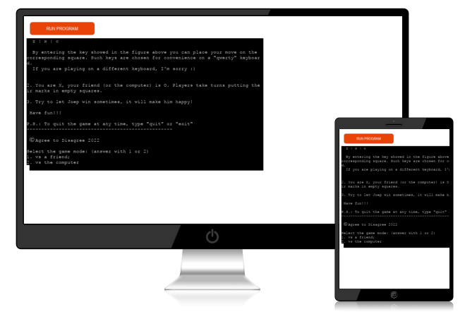
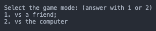
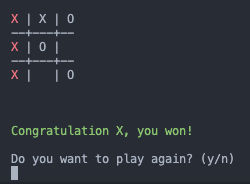
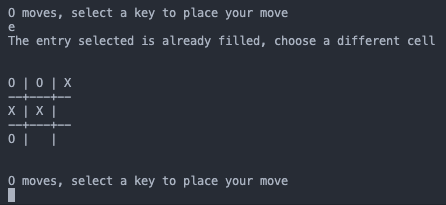

<h1 align="center">
    Tic-Tac-Toe (Cabaret Edition)
</h1>

[View the live project here.](https://caba-tic-tac-toe.herokuapp.com/)

The Cabaret Tic-Tac-Toe is a Python terminal game, running in the Code Institute mock terminal on Heroku.

Play with your friends and family or challenge our artificial intelligence (AI) Joep to see if machines are ready to defeat us!

 
<h2 align="center"></h2>

## How to play

Tic-tac-toe rules are simple and well defined, you can consult [wikipedia](https://en.wikipedia.org/wiki/Tic-tac-toe) to refresh your mind.
Specifically, to play on this platform you need to remember the following simple rules:

1. The game is played on a grid that\'s 3 squares by 3. Each square is identified by a key and it can be represented as:\
| q | w | e |\
---+--+--\
| a | s | d |\
---+--+--\
| z | x | c |
\
 By entering the key showed in the figure above you can place your move on the corresponding square. Such keys are chosen 
 for convenience on a "qwerty" keyboard.\
 If you are playing on a different keyboard, I\'m sorry :)

2. You are X, your friend (or the computer) is O. Players take turns putting their marks in empty squares.

3. Try to let Joep win sometimes, it will make him happy!

Have fun!!!\
P.S.: To quit the game at any time, type "quit" or "exit"

## Features

### Existing Features

- Accepts user input.
- Different game mode:
    - vs a friend,
    - vs computer.

<h2></h2>

- Colour prompt to highlight victories and messages.
- Possibility of playing again, with alternating first movers.
- Possibility of quitting the game without finishing it.

<h2></h2>

- Input validation:
    - with every input request you can only enter the specified answers, otherwise you will be asked to enter the input again after a useful error message.
    - within the game, you can only play in the the empty cell. Hence, if the input is out of the game field you will be ask to enter again the input. The same will happen if you are playing inside the field, but in a cell alredy filled.

<h2></h2>

### Future feature

- Within a game strike (same game restarted more times) it will be possible to count the number of match won by each player. In simple words, there will be a **score**.

## Data Model

The most interesting part of the project is how the computer keeps track of the game status, and eventually (in the vs. computer mode) decide how to move.\

For an easier understanding I will explain the algorithm in steps:
1. The classic game board, with Xs and Os, is translated in a matrix (status matrix from now on) of 1, -1 and 0. The trasformation is done by mutating Xs in 1s, Os in -1s and empty cells in 0s. 
2. Then the code perfom a sum of the status matrix cells over each of the possible winning combination (columns, rows and diagonals). Such result is employed in both determining if there is a victory and decide the next computer move.
3. In determining the victory, the computer detect if there is a winning combination that either sums to 3 or -3. Once a victory is in place, knowing which of the 8 possible combination was exploited, the computer renders the game field with the winning trio highlighted. Moreover, the winner is printed in the console.
4. In determining the next computer move, the sum of the winning combination are used to compute the distance both for the computer itslef (how far is from -3) and the opponent (how far is from 3). With the distances computed, the computer will choose to play on the winning combination of its opponent if she is closer to a winning. An example could be: the opponent has a max score among the possible combination of 2, while computer max score is -1. Then the computer is further from -3 than the opponent is to 3 and will play on the rival winning combination. If any tied score is in place, the computer will choose randomly among the same max scores.

## Testing 

The code have been tested by:

- Passing it through a [PEP8](http://pep8online.com/) validator
- Given invalid inputs: each type of input different from the required are expected.
- Tested on local terminal and on the Code Institute Heroku terminal.

## Bugs 

### Solved Bugs 
- Within the computer choice algorithm it was possible that the best move wasn't possible. In such rare cases, the computer will play randomly among the empty cells.

### Remaining Bugs
- There are no remaining bugs that I am aware of. If any is found, don't hesitate to contact me.

### Validator
- [PEP8](http://pep8online.com/):
    - No error or warnings were returned

## Deployment

This project was deployed usind Code Institute's mock terminal for Heroku.
 
- Steps for deployment:
    - Fork or clone this repository
    - Create a new Heroku.app
    - Set the buildback to Python and NodeJS in that order
    - Link the Heroku.app to the repository
    - Click **Deploy**

## Credits

- Code Institute for the deployment terminal
- [Wikipedia](https://it.wikipedia.org/wiki/Pagina_principale) for the details of the tic-tac-toe game
- [James Shah](https://medium.com/@jdshah18072000) for the idea of using dictionary to store the input values and build the game field.
